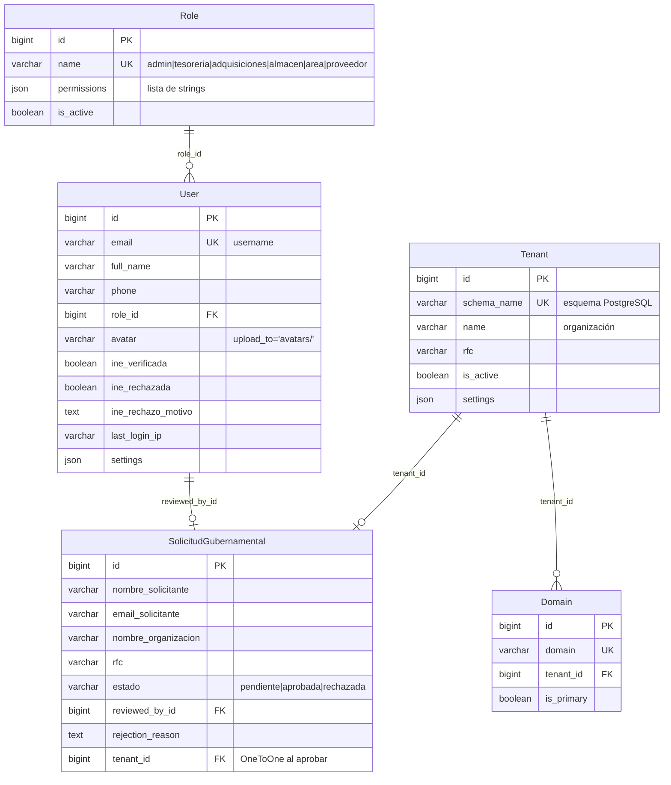
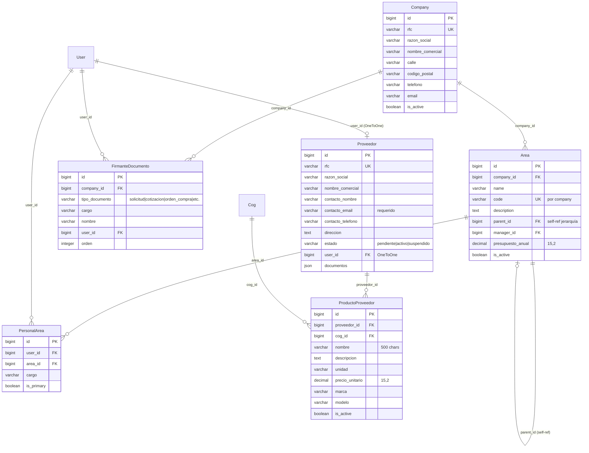
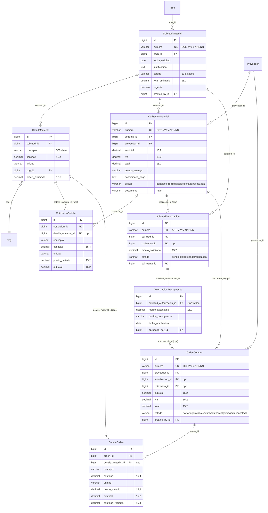
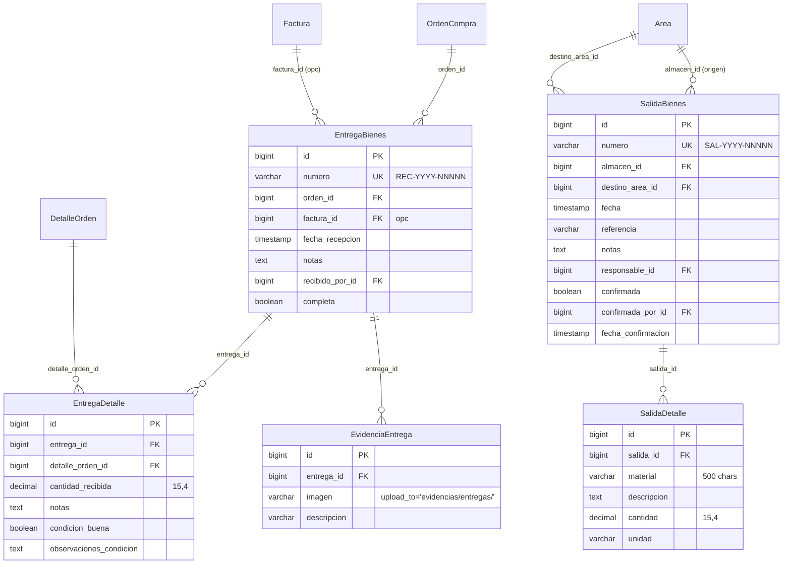
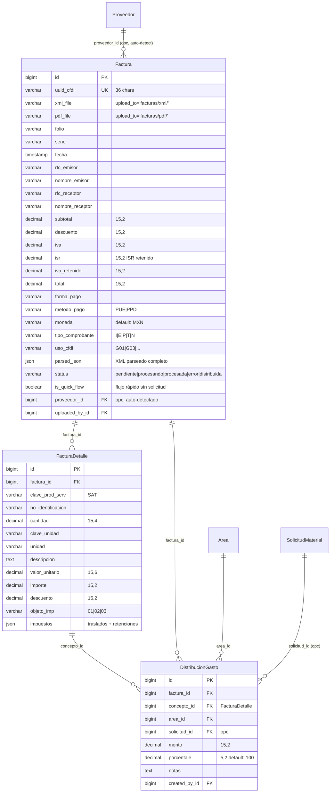
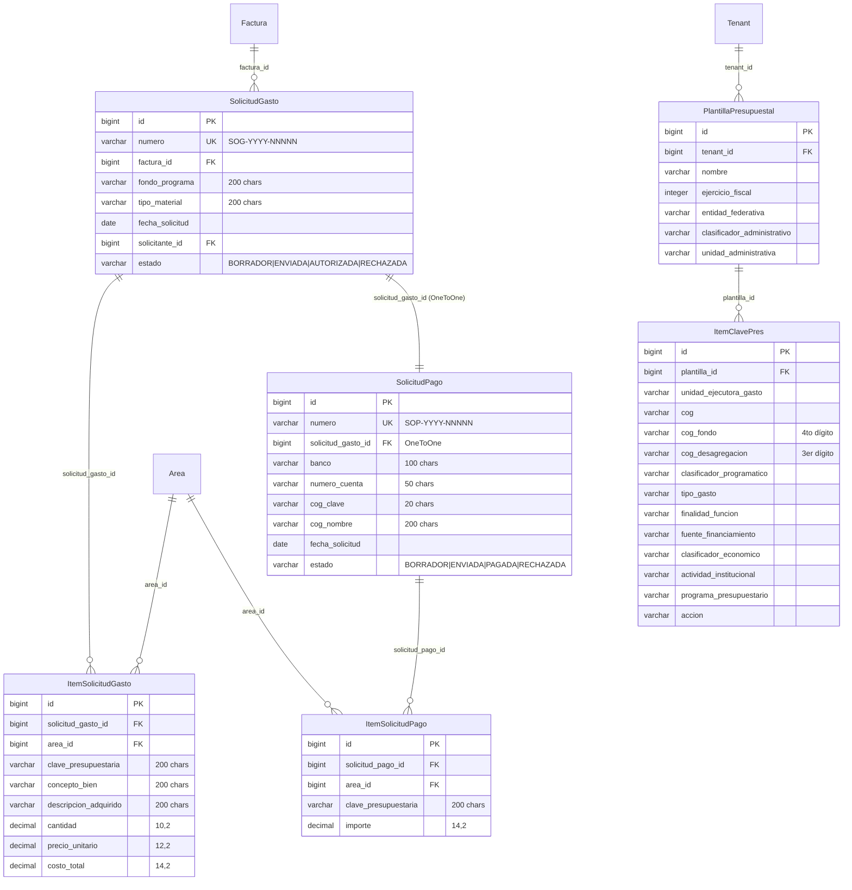
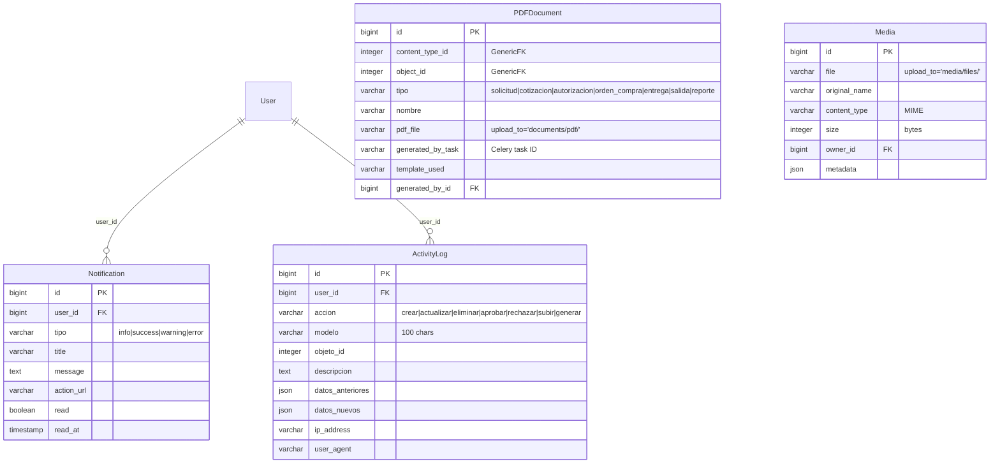
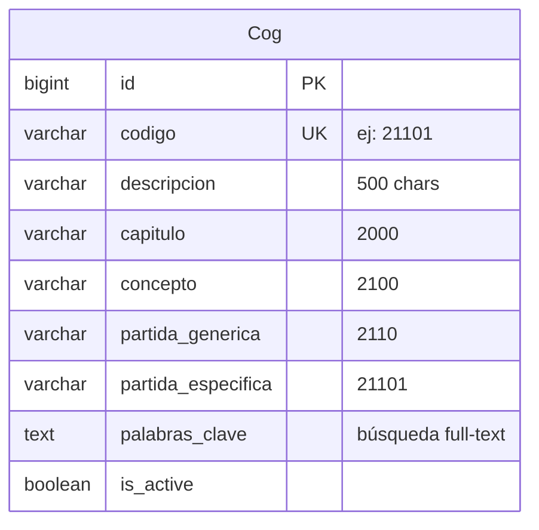

# 🗄️ Esquema de Base de Datos — Gastos Distribuidos v2

Modelo de datos completo: 38 entidades en 13 aplicaciones Django.
Arquitectura multi-tenant con **django-tenants** (esquema por tenant en PostgreSQL 15+).

---

## Tabla de Contenidos

- [Vista General por Módulos](#vista-general-por-módulos)
- [1. Núcleo: Usuarios, Roles y Multi-tenancy](#1-núcleo-usuarios-roles-y-multi-tenancy)
- [2. Organización: Compañías, Áreas y Proveedores](#2-organización-compañías-áreas-y-proveedores)
- [3. Flujo de Procuración](#3-flujo-de-procuración)
- [4. Inventario y Distribución](#4-inventario-y-distribución)
- [5. Facturación CFDI 4.0](#5-facturación-cfdi-40)
- [6. Tesorería y Presupuestos](#6-tesorería-y-presupuestos)
- [7. Documentos, Media y Auditoría](#7-documentos-media-y-auditoría)
- [8. Catálogo COG](#8-catálogo-cog)
- [Índices y Optimización](#índices-y-optimización)
- [Migraciones y Backup](#migraciones-y-backup)

---

## Vista General por Módulos

```mermaid
flowchart TB
    subgraph core["🔐 accounts · tenants"]
        Role[Role]
        User[User]
        Tenant[Tenant]
        Domain[Domain]
        SolGub[SolicitudGubernamental]
        Role -->|"role_id"| User
        Tenant -->|"tenant_id"| Domain
    end

    subgraph org["🏢 companies · areas"]
        Company[Company]
        Proveedor[Proveedor]
        ProdProv[ProductoProveedor]
        Firmante[FirmanteDocumento]
        Area[Area]
        PerArea[PersonalArea]
        User -->|"user_id"| Proveedor
        Proveedor -->|"proveedor_id"| ProdProv
        Company -->|"company_id"| Area
        Company -->|"company_id"| Firmante
        Area -->|"parent_id"| Area
        User -->|"user_id"| PerArea
        Area -->|"area_id"| PerArea
    end

    subgraph proc["📋 procurement · quotations · orders"]
        Cog[Cog]
        SolMat[SolicitudMaterial]
        DetMat[DetalleMaterial]
        CotMat[CotizacionMaterial]
        CotDet[CotizacionDetalle]
        SolAut[SolicitudAutorizacion]
        AutPres[AutorizacionPresupuestal]
        OrdCom[OrdenCompra]
        DetOrd[DetalleOrden]
        Area -->|"area_id"| SolMat
        SolMat -->|"solicitud_id"| DetMat
        Cog -->|"cog_id"| DetMat
        SolMat -->|"solicitud_id"| CotMat
        Proveedor -->|"proveedor_id"| CotMat
        CotMat -->|"cotizacion_id"| CotDet
        SolMat -->|"solicitud_id"| SolAut
        SolAut -->|"1:1"| AutPres
        CotMat -->|"cotizacion_id"| OrdCom
        AutPres -->|"autorizacion_id"| OrdCom
        Proveedor -->|"proveedor_id"| OrdCom
        OrdCom -->|"orden_id"| DetOrd
    end

    subgraph inv["📦 inventory"]
        EntBien[EntregaBienes]
        EntDet[EntregaDetalle]
        EvEnt[EvidenciaEntrega]
        SalBien[SalidaBienes]
        SalDet[SalidaDetalle]
        OrdCom -->|"orden_id"| EntBien
        EntBien -->|"entrega_id"| EntDet
        EntBien -->|"entrega_id"| EvEnt
        DetOrd -->|"detalle_orden_id"| EntDet
        Area -->|"almacen_id"| SalBien
        Area -->|"destino_area_id"| SalBien
        SalBien -->|"salida_id"| SalDet
    end

    subgraph cfd["🧾 invoices"]
        Factura[Factura]
        FacDet[FacturaDetalle]
        DistGasto[DistribucionGasto]
        Proveedor -->|"proveedor_id"| Factura
        Factura -->|"factura_id"| FacDet
        Factura -->|"factura_id"| DistGasto
        FacDet -->|"concepto_id"| DistGasto
        Area -->|"area_id"| DistGasto
        EntBien -->|"factura_id"| Factura
    end

    subgraph tes["💰 treasury · budget"]
        SolGas[SolicitudGasto]
        ItemSG[ItemSolicitudGasto]
        SolPag[SolicitudPago]
        ItemSP[ItemSolicitudPago]
        PlanPre[PlantillaPresupuestal]
        ItemCP[ItemClavePres]
        Factura -->|"factura_id"| SolGas
        SolGas -->|"1:1"| SolPag
        SolGas -->|"solicitud_gasto_id"| ItemSG
        SolPag -->|"solicitud_pago_id"| ItemSP
        Tenant -->|"tenant_id"| PlanPre
        PlanPre -->|"plantilla_id"| ItemCP
    end

    subgraph aux["📎 documents · notifications"]
        PDF[PDFDocument]
        Media[Media]
        Notif[Notification]
        ActLog[ActivityLog]
        User -->|"user_id"| Notif
        User -->|"user_id"| ActLog
    end

    %% cross-module connections
    User -->|"created_by_id"| SolMat
    User -->|"uploaded_by_id"| Factura
    User -->|"solicitante_id"| SolGas
    User -->|"created_by_id"| OrdCom
    SolMat -->|"solicitud_id"| DistGasto

    style core fill:#e3f2fd,stroke:#1976d2,color:#000
    style org fill:#e8f5e9,stroke:#388e3c,color:#000
    style proc fill:#fff3e0,stroke:#f57c00,color:#000
    style inv fill:#fce4ec,stroke:#c2185b,color:#000
    style cfd fill:#f3e5f5,stroke:#7b1fa2,color:#000
    style tes fill:#e0f2f1,stroke:#00796b,color:#000
    style aux fill:#eceff1,stroke:#546e7a,color:#000
```



### Resumen de Apps y Entidades

| App Django | # | Entidades |
|------------|---|-----------|
| **accounts** | 2 | Role, User |
| **tenants** | 3 | Tenant, Domain, SolicitudGubernamental |
| **companies** | 4 | Company, Proveedor, ProductoProveedor, FirmanteDocumento |
| **areas** | 2 | Area, PersonalArea |
| **procurement** | 3 | Cog, SolicitudMaterial, DetalleMaterial |
| **quotations** | 2 | CotizacionMaterial, CotizacionDetalle |
| **orders** | 4 | SolicitudAutorizacion, AutorizacionPresupuestal, OrdenCompra, DetalleOrden |
| **inventory** | 5 | EntregaBienes, EntregaDetalle, EvidenciaEntrega, SalidaBienes, SalidaDetalle |
| **invoices** | 3 | Factura, FacturaDetalle, DistribucionGasto |
| **treasury** | 4 | SolicitudGasto, ItemSolicitudGasto, SolicitudPago, ItemSolicitudPago |
| **budget** | 2 | PlantillaPresupuestal, ItemClavePres |
| **documents** | 2 | PDFDocument, Media |
| **notifications** | 2 | Notification, ActivityLog |
| **Total** | **38** | |

---

## 1. Núcleo: Usuarios, Roles y Multi-tenancy



### User

Extiende `AbstractUser`. Usa `email` como `USERNAME_FIELD`.

| Campo | Tipo | Descripción |
|-------|------|-------------|
| `id` | BigAutoField PK | |
| `email` | EmailField UNIQUE | Username |
| `full_name` | CharField(255) | |
| `phone` | CharField(20) | |
| `role` | FK → Role PROTECT | Control de acceso |
| `avatar` | ImageField | |
| `ine_foto` | ImageField | Verificación de identidad |
| `ine_verificada` | BooleanField | |
| `ine_rechazada` | BooleanField | |
| `ine_rechazo_motivo` | TextField | |
| `last_login_ip` | GenericIPAddressField | |
| `settings` | JSONField | default: {} |

### Role

| Campo | Tipo |
|-------|------|
| `name` | `admin` / `tesoreria` / `adquisiciones` / `almacen` / `area` / `proveedor` |
| `permissions` | JSONField (lista de strings) |

### Tenant

Arquitectura **schema-per-tenant**. El esquema `public` contiene Tenant, Domain y SolicitudGubernamental. Cada tenant tiene su propio esquema PostgreSQL con todas las demás tablas replicadas.

---

## 2. Organización: Compañías, Áreas y Proveedores



### Restricciones de Unicidad

| Tabla | Constraint |
|-------|-----------|
| Proveedor | `rfc` UNIQUE, `user_id` UNIQUE |
| ProductoProveedor | `(proveedor, nombre, unidad)` UNIQUE |
| FirmanteDocumento | `(company, tipo_documento, orden)` UNIQUE |
| Area | `(company, code)` UNIQUE |
| PersonalArea | `(user, area)` UNIQUE |

---

## 3. Flujo de Procuración



### Numeración de Documentos

| Documento | Prefijo | Formato |
|-----------|---------|---------|
| Solicitud de Material | `SOL` | SOL-YYYY-NNNNN |
| Cotización | `COT` | COT-YYYY-NNNNN |
| Solicitud de Autorización | `AUT` | AUT-YYYY-NNNNN |
| Orden de Compra | `OC` | OC-YYYY-NNNNN |
| Recepción de Bienes | `REC` | REC-YYYY-NNNNN |
| Salida de Bienes | `SAL` | SAL-YYYY-NNNNN |
| Solicitud de Gasto | `SOG` | SOG-YYYY-NNNNN |
| Solicitud de Pago | `SOP` | SOP-YYYY-NNNNN |

---

## 4. Inventario y Distribución



---

## 5. Facturación CFDI 4.0



---

## 6. Tesorería y Presupuestos



---

## 7. Documentos, Media y Auditoría



**PDFDocument** usa `GenericForeignKey` de Django para vincularse a cualquier entidad (SolicitudMaterial, CotizacionMaterial, OrdenCompra, etc.). Los PDFs se generan asíncronamente vía Celery + WeasyPrint.

---

## 8. Catálogo COG

Clasificador por Objeto del Gasto — catálogo presupuestario mexicano con jerarquía de 4 niveles.



### Jerarquía del COG

```
Capítulo 2000 — Materiales y Suministros
  └─ Concepto 2100 — Materiales de Administración
       └─ PG 2110 — Materiales de Oficina
            ├─ PE 21101 — Papelería
            └─ PE 21102 — Útiles de Oficina
       └─ PG 2160 — Material de Cómputo
            ├─ PE 21601 — Consumibles de Cómputo
            └─ PE 21602 — Tóner y Cartuchos
```

El COG se relaciona con `DetalleMaterial` (clasifica cada ítem de solicitud) y con `ProductoProveedor` (catálogo de productos del proveedor).

---

## Índices y Optimización

### Índices por Aplicación

| App | Tabla | Índices |
|-----|-------|---------|
| accounts | User | email (UK), role_id, is_active |
| companies | Proveedor | rfc (UK), user_id (UK), estado, contacto_email |
| companies | ProductoProveedor | (proveedor, nombre, unidad) UK |
| companies | FirmanteDocumento | (company, tipo_documento, orden) UK |
| areas | Area | (company, code) UK, parent_id |
| areas | PersonalArea | (user, area) UK |
| procurement | Cog | codigo (UK) |
| procurement | SolicitudMaterial | numero (UK), estado, area_id, created_by_id |
| procurement | DetalleMaterial | solicitud_id, cog_id |
| quotations | CotizacionMaterial | numero (UK), solicitud_id, proveedor_id, estado |
| orders | OrdenCompra | numero (UK), proveedor_id, estado, fecha_emision |
| orders | SolicitudAutorizacion | numero (UK), solicitud_id |
| orders | AutorizacionPresupuestal | solicitud_autorizacion_id (UK) |
| inventory | EntregaBienes | numero (UK), orden_id, fecha_recepcion |
| inventory | SalidaBienes | numero (UK), almacen_id, destino_area_id |
| invoices | Factura | uuid_cfdi (UK), proveedor_id, rfc_emisor, status, fecha |
| invoices | DistribucionGasto | factura_id, area_id, concepto_id |
| treasury | SolicitudGasto | numero (UK), factura_id |
| treasury | SolicitudPago | numero (UK), solicitud_gasto_id (UK) |
| budget | PlantillaPresupuestal | (tenant, nombre, ejercicio_fiscal) UK |
| notifications | Notification | user_id, read, created_at |
| notifications | ActivityLog | user_id, modelo, created_at |

### Índices Compuestos para Rendimiento

```sql
-- Dashboard: solicitudes por estado y fecha
CREATE INDEX idx_sol_estado_fecha
ON procurement_solicitudmaterial(estado, created_at DESC);

-- Órdenes pendientes de entrega
CREATE INDEX idx_orden_pendiente
ON orders_ordencompra(estado, proveedor_id)
WHERE estado IN ('enviada', 'confirmada', 'parcial');

-- Facturas pendientes de procesar
CREATE INDEX idx_factura_pendiente
ON invoices_factura(status, fecha)
WHERE status = 'pendiente';

-- Distribuciones por área (reportes financieros)
CREATE INDEX idx_dist_area_monto
ON invoices_distribuciongasto(area_id, monto);

-- Búsqueda full-text: proveedores
CREATE INDEX idx_proveedor_search
ON companies_proveedor
USING gin(to_tsvector('spanish', razon_social || ' ' || rfc));

-- Búsqueda full-text: COG
CREATE INDEX idx_cog_search
ON procurement_cog
USING gin(to_tsvector('spanish', descripcion || ' ' || palabras_clave));
```

---

## Migraciones y Backup

### Comandos Django

```bash
# Windows PowerShell (desde backend/)
python manage.py makemigrations <app_name>
python manage.py sqlmigrate <app_name> <migration_number>
python manage.py migrate
python manage.py migrate_schemas       # django-tenants: replica en todos los tenants
python manage.py showmigrations

# Crear tenant
python manage.py create_tenant --schema_name=org_001 --name="Organización" --domain=org.midominio.com
```

### Backup PostgreSQL (Producción)

```bash
# Backup completo (todos los esquemas)
pg_dump -h $DB_HOST -U $DB_USER -d $DB_NAME -F c -f backup_$(date +%Y%m%d).dump

# Backup de un tenant específico
pg_dump -h $DB_HOST -U $DB_USER -d $DB_NAME -n schema_001 -F c -f tenant_001.dump

# Restore
pg_restore -h $DB_HOST -U $DB_USER -d $DB_NAME -c backup_20260505.dump
```

### Backup SQLite (Desarrollo)

```powershell
Copy-Item -LiteralPath "db.sqlite3" -Destination "db_backup_$(Get-Date -Format 'yyyyMMdd').sqlite3"
```

---

*Última actualización: mayo 2026 — 38 entidades, 13 apps Django, PostgreSQL 15+ con django-tenants.*
