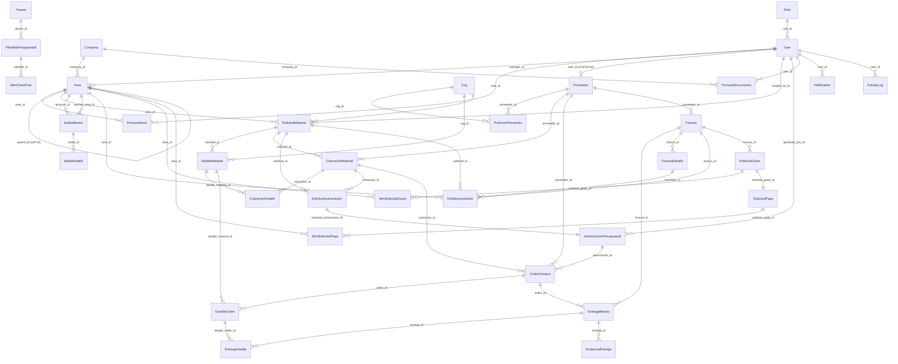
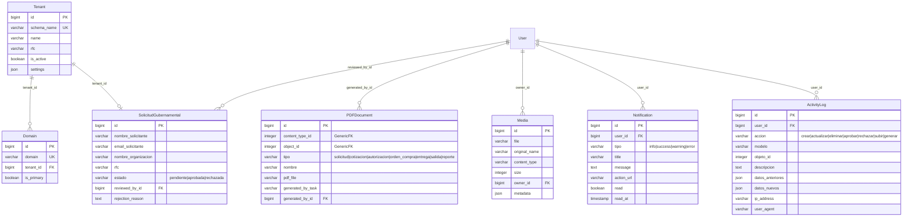

# 🗄️ Esquema de Base de Datos — Gastos Distribuidos v2

Modelo de datos completo con 38 entidades agrupadas en 13 aplicaciones Django.
Arquitectura multi-tenant con django-tenants (esquema por tenant en PostgreSQL 15+).

---

## Tabla de Contenidos

- [Diagrama ERD General](#diagrama-erd-general)
- [1. Multi-tenancy](#1-multi-tenancy)
- [2. Usuarios y Roles](#2-usuarios-y-roles)
- [3. Compañías y Proveedores](#3-compañías-y-proveedores)
- [4. Áreas y Personal](#4-áreas-y-personal)
- [5. COG — Clasificador por Objeto del Gasto](#5-cog--clasificador-por-objeto-del-gasto)
- [6. Solicitudes de Material](#6-solicitudes-de-material)
- [7. Cotizaciones](#7-cotizaciones)
- [8. Autorización Presupuestal y Órdenes de Compra](#8-autorización-presupuestal-y-órdenes-de-compra)
- [9. Inventario (Entregas y Salidas)](#9-inventario-entregas-y-salidas)
- [10. Facturación CFDI 4.0 y Distribución de Gastos](#10-facturación-cfdi-40-y-distribución-de-gastos)
- [11. Tesorería](#11-tesorería)
- [12. Presupuestos](#12-presupuestos)
- [13. Documentos y Notificaciones](#13-documentos-y-notificaciones)
- [Índices y Optimización](#índices-y-optimización)
- [Migraciones y Backup](#migraciones-y-backup)

---

## Diagrama ERD General

### Flujo Principal de Procuración



### Módulos de Soporte (Tenants, Documentos)



---

## 1. Multi-tenancy

Arquitectura **schema-per-tenant** vía django-tenants. El esquema `public` contiene tenants, dominios y solicitudes de registro. Cada tenant tiene su propio esquema PostgreSQL con todas las tablas de negocio replicadas.

### Tenant

| Campo | Tipo | Descripción |
|-------|------|-------------|
| `id` | BigAutoField PK | |
| `schema_name` | CharField(63) UNIQUE | Nombre del esquema PostgreSQL |
| `name` | CharField(255) | Nombre de la organización |
| `rfc` | CharField(13) | RFC (opcional) |
| `is_active` | BooleanField | default: True |
| `settings` | JSONField | Configuración del tenant |
| `created_at` | DateTimeField | |
| `updated_at` | DateTimeField | |

### Domain

| Campo | Tipo | Descripción |
|-------|------|-------------|
| `id` | BigAutoField PK | |
| `domain` | CharField(253) UNIQUE | Dominio (ej: tenant.midominio.com) |
| `tenant` | FK → Tenant CASCADE | Tenant dueño |
| `is_primary` | BooleanField | default: True |

### SolicitudGubernamental

| Campo | Tipo | Descripción |
|-------|------|-------------|
| `id` | BigAutoField PK | |
| `nombre_solicitante` | CharField(255) | |
| `email_solicitante` | EmailField | |
| `telefono` | CharField(20) | Opcional |
| `nombre_organizacion` | CharField(255) | |
| `rfc` | CharField(13) | |
| `direccion` | TextField | Opcional |
| `estado` | CharField(20) | pendiente / aprobada / rechazada |
| `attachments` | JSONField | default: [] |
| `reviewed_by` | FK → User SET_NULL | |
| `reviewed_at` | DateTimeField | |
| `rejection_reason` | TextField | |
| `tenant` | OneToOne → Tenant SET_NULL | Se asigna al aprobar |

---

## 2. Usuarios y Roles

### Role

| Campo | Tipo | Descripción |
|-------|------|-------------|
| `id` | BigAutoField PK | |
| `name` | CharField(50) | admin / tesoreria / adquisiciones / almacen / area / proveedor |
| `description` | TextField | Opcional |
| `permissions` | JSONField | Lista de strings de permisos |
| `is_active` | BooleanField | default: True |
| `created_at` | DateTimeField | |
| `updated_at` | DateTimeField | |

### User

Extiende `AbstractUser` de Django. Usa `email` como username (`USERNAME_FIELD = 'email'`).

| Campo | Tipo | Descripción |
|-------|------|-------------|
| `id` | BigAutoField PK | |
| `email` | EmailField UNIQUE | Usado como username |
| `full_name` | CharField(255) | Nombre completo para display |
| `phone` | CharField(20) | Opcional |
| `role` | FK → Role PROTECT | Rol del usuario |
| `avatar` | ImageField | upload_to='avatars/' |
| `ine_foto` | ImageField | upload_to='ine/' (verificación identidad) |
| `ine_verificada` | BooleanField | default: False |
| `ine_rechazada` | BooleanField | default: False |
| `ine_rechazo_motivo` | TextField | Opcional |
| `last_login_ip` | GenericIPAddressField | Opcional |
| `settings` | JSONField | default: {} |
| Campos heredados | `password`, `is_superuser`, `is_staff`, `is_active`, `date_joined`, `last_login` | |

**Índices:** `email` (único), `role_id`, `ine_verificada`

---

## 3. Compañías y Proveedores

### Company

Entidad que representa a la organización dueña del tenant.

| Campo | Tipo | Descripción |
|-------|------|-------------|
| `id` | BigAutoField PK | |
| `rfc` | CharField(13) UNIQUE | |
| `razon_social` | CharField(255) | |
| `nombre_comercial` | CharField(255) | Opcional |
| `calle`, `numero_exterior`, `numero_interior` | CharField | Dirección |
| `colonia`, `municipio`, `estado` | CharField | |
| `codigo_postal` | CharField(10) | |
| `telefono` | CharField(20) | |
| `email` | EmailField | |
| `logo` | ImageField | upload_to='company_logos/' |
| `membrete` | ImageField | upload_to='company_membretes/' |
| `pie_pagina` | ImageField | upload_to='company_pies/' |
| `is_active` | BooleanField | default: True |
| `created_by` | FK → User SET_NULL | |
| `created_at`, `updated_at` | DateTimeField | |

### Proveedor

| Campo | Tipo | Descripción |
|-------|------|-------------|
| `id` | BigAutoField PK | |
| `rfc` | CharField(13) UNIQUE | |
| `razon_social` | CharField(255) | |
| `nombre_comercial` | CharField(255) | Opcional |
| `contacto_nombre` | CharField(255) | |
| `contacto_email` | EmailField | Requerido |
| `contacto_telefono` | CharField(20) | Opcional |
| `direccion` | TextField | |
| `logo` | ImageField | upload_to='proveedor_logos/' |
| `membrete` | ImageField | upload_to='proveedor_membretes/' |
| `estado` | CharField(20) | pendiente / activo / suspendido |
| `user` | OneToOne → User SET_NULL | Perfil de usuario del proveedor |
| `documentos` | JSONField | default: [] |
| `created_at`, `updated_at` | DateTimeField | |

**Índices:** `rfc` (único), `user_id` (único), `estado`, `contacto_email`

### ProductoProveedor

Catálogo de productos que ofrece cada proveedor.

| Campo | Tipo | Descripción |
|-------|------|-------------|
| `id` | BigAutoField PK | |
| `proveedor` | FK → Proveedor CASCADE | |
| `cog` | FK → Cog PROTECT | Clasifica el producto |
| `nombre` | CharField(500) | |
| `descripcion` | TextField | |
| `unidad` | CharField(50) | Unidad de medida |
| `precio_unitario` | DecimalField(15,2) | |
| `marca`, `modelo` | CharField(255) | |
| `is_active` | BooleanField | default: True |

**UniqueConstraint:** `(proveedor, nombre, unidad)`

### FirmanteDocumento

Configuración de firmantes por tipo de documento.

| Campo | Tipo | Descripción |
|-------|------|-------------|
| `id` | BigAutoField PK | |
| `company` | FK → Company CASCADE | |
| `tipo_documento` | CharField(30) | solicitud / cotizacion / solicitud_autorizacion / autorizacion / orden_compra / entrega / salida / solicitud_gasto / solicitud_pago / distribucion_gasto |
| `cargo` | CharField(255) | Puesto del firmante |
| `nombre` | CharField(255) | Nombre fijo (opcional, override) |
| `user` | FK → User SET_NULL | |
| `sello_imagen` | ImageField | upload_to='sellos_firmantes/' |
| `orden` | PositiveIntegerField | default: 1 |

**UniqueConstraint:** `(company, tipo_documento, orden)`

---

## 4. Áreas y Personal

### Area

Jerarquía organizacional mediante auto-referencia (`parent`).

| Campo | Tipo | Descripción |
|-------|------|-------------|
| `id` | BigAutoField PK | |
| `company` | FK → Company CASCADE | |
| `name` | CharField(255) | |
| `code` | CharField(50) | Código único por company |
| `description` | TextField | |
| `manager` | FK → User SET_NULL | Responsable |
| `parent` | FK → self SET_NULL | Área padre (jerarquía) |
| `presupuesto_anual` | DecimalField(15,2) | default: 0 |
| `is_active` | BooleanField | default: True |
| `created_by` | FK → User SET_NULL | |

**UniqueConstraint:** `(company, code)`

### PersonalArea

Asignación de usuarios a áreas (relación muchos a muchos con atributos).

| Campo | Tipo | Descripción |
|-------|------|-------------|
| `id` | BigAutoField PK | |
| `user` | FK → User CASCADE | |
| `area` | FK → Area CASCADE | |
| `cargo` | CharField(255) | Puesto en el área |
| `is_primary` | BooleanField | default: True (área principal) |

**UniqueConstraint:** `(user, area)`

---

## 5. COG — Clasificador por Objeto del Gasto

Catálogo de partidas presupuestarias del gobierno mexicano con jerarquía de 4 niveles.

### Cog

| Campo | Tipo | Descripción |
|-------|------|-------------|
| `id` | BigAutoField PK | |
| `codigo` | CharField(20) UNIQUE | Código completo (ej: "21101") |
| `descripcion` | CharField(500) | |
| `capitulo` | CharField(10) | Nivel 1 (ej: "2000") |
| `concepto` | CharField(10) | Nivel 2 (ej: "2100") |
| `partida_generica` | CharField(10) | Nivel 3 (ej: "2110") |
| `partida_especifica` | CharField(10) | Nivel 4 (ej: "21101") |
| `palabras_clave` | TextField | Para búsqueda |
| `is_active` | BooleanField | default: True |

**Índices:** `codigo` (único), `capitulo`, `concepto`, `is_active`

---

## 6. Solicitudes de Material

### SolicitudMaterial

| Campo | Tipo | Descripción |
|-------|------|-------------|
| `id` | BigAutoField PK | |
| `area` | FK → Area PROTECT | Área solicitante |
| `numero` | CharField(50) UNIQUE | SOL-YYYY-NNNNN (autogenerado) |
| `fecha_solicitud` | DateField | |
| `descripcion` | TextField | Opcional |
| `justificacion` | TextField | Opcional |
| `eje_rector` | TextField | |
| `programa_presupuestario` | TextField | |
| `actividad` | TextField | |
| `estado` | CharField(30) | Ver estados abajo |
| `total_estimado` | DecimalField(15,2) | default: 0 |
| `urgente` | BooleanField | default: False |
| `fecha_requerida` | DateField | |
| `created_by` | FK → User PROTECT | |

**Estados:** `pendiente_verificacion`, `ine_rechazada`, `borrador`, `enviado`, `en_cotizacion`, `cotizado`, `en_autorizacion`, `autorizado`, `en_orden`, `parcial`, `entregado`, `cancelado`

**Índices:** `numero` (único), `estado`, `area_id`, `created_by_id`, `fecha_solicitud`

### DetalleMaterial

| Campo | Tipo | Descripción |
|-------|------|-------------|
| `id` | BigAutoField PK | |
| `solicitud` | FK → SolicitudMaterial CASCADE | |
| `concepto` | CharField(500) | |
| `descripcion` | TextField | |
| `cantidad` | DecimalField(15,4) | |
| `unidad` | CharField(50) | |
| `cog` | FK → Cog PROTECT | Clasificación |
| `precio_estimado` | DecimalField(15,2) | default: 0 |
| `notas` | TextField | |

**Índices:** `solicitud_id`, `cog_id`

---

## 7. Cotizaciones

### CotizacionMaterial

| Campo | Tipo | Descripción |
|-------|------|-------------|
| `id` | BigAutoField PK | |
| `solicitud` | FK → SolicitudMaterial CASCADE | |
| `proveedor` | FK → Proveedor PROTECT | |
| `numero` | CharField(50) UNIQUE | COT-YYYY-NNNNN |
| `fecha` | DateField | |
| `vigencia` | DateField | Opcional |
| `subtotal` | DecimalField(15,2) | default: 0 |
| `iva` | DecimalField(15,2) | default: 0 |
| `total` | DecimalField(15,2) | default: 0 |
| `tiempo_entrega` | CharField(100) | |
| `condiciones_pago` | TextField | |
| `notas` | TextField | |
| `estado` | CharField(20) | pendiente / recibida / seleccionada / rechazada |
| `documento` | FileField | upload_to='cotizaciones/' |

**Índices:** `numero` (único), `solicitud_id`, `proveedor_id`, `estado`

### CotizacionDetalle

| Campo | Tipo | Descripción |
|-------|------|-------------|
| `id` | BigAutoField PK | |
| `cotizacion` | FK → CotizacionMaterial CASCADE | |
| `detalle_material` | FK → DetalleMaterial SET_NULL | Opcional |
| `concepto` | CharField(500) | |
| `descripcion` | TextField | |
| `cantidad` | DecimalField(15,4) | |
| `unidad` | CharField(50) | |
| `precio_unitario` | DecimalField(15,2) | |
| `subtotal` | DecimalField(15,2) | Auto-calculado |

---

## 8. Autorización Presupuestal y Órdenes de Compra

### SolicitudAutorizacion

| Campo | Tipo | Descripción |
|-------|------|-------------|
| `id` | BigAutoField PK | |
| `solicitud` | FK → SolicitudMaterial CASCADE | |
| `cotizacion` | FK → CotizacionMaterial SET_NULL | Opcional |
| `numero` | CharField(50) UNIQUE | AUT-YYYY-NNNNN |
| `fecha_solicitud` | DateField | auto |
| `monto_solicitado` | DecimalField(15,2) | |
| `justificacion` | TextField | |
| `estado` | CharField(20) | pendiente / aprobada / rechazada |
| `motivo_rechazo` | TextField | |
| `solicitante` | FK → User PROTECT | |

### AutorizacionPresupuestal

| Campo | Tipo | Descripción |
|-------|------|-------------|
| `id` | BigAutoField PK | |
| `solicitud_autorizacion` | OneToOne → SolicitudAutorizacion CASCADE | |
| `monto_autorizado` | DecimalField(15,2) | |
| `partida_presupuestal` | CharField(100) | Opcional |
| `fecha_aprobacion` | DateField | |
| `observaciones` | TextField | |
| `aprobado_por` | FK → User PROTECT | |

### OrdenCompra

| Campo | Tipo | Descripción |
|-------|------|-------------|
| `id` | BigAutoField PK | |
| `proveedor` | FK → Proveedor PROTECT | |
| `autorizacion` | FK → AutorizacionPresupuestal PROTECT | Opcional |
| `cotizacion` | FK → CotizacionMaterial SET_NULL | Opcional |
| `numero` | CharField(50) UNIQUE | OC-YYYY-NNNNN |
| `fecha_emision` | DateField | |
| `fecha_entrega_esperada` | DateField | |
| `subtotal` | DecimalField(15,2) | default: 0 |
| `iva` | DecimalField(15,2) | default: 0 |
| `total` | DecimalField(15,2) | default: 0 |
| `condiciones_pago` | TextField | |
| `lugar_entrega` | TextField | |
| `notas` | TextField | |
| `estado` | CharField(20) | borrador / enviada / confirmada / parcial / entregada / cancelada |
| `referencia_externa` | CharField(100) | |
| `created_by` | FK → User PROTECT | |

**Índices:** `numero` (único), `proveedor_id`, `estado`, `fecha_emision`

### DetalleOrden

| Campo | Tipo | Descripción |
|-------|------|-------------|
| `id` | BigAutoField PK | |
| `orden` | FK → OrdenCompra CASCADE | |
| `detalle_material` | FK → DetalleMaterial SET_NULL | Opcional |
| `concepto` | CharField(500) | |
| `descripcion` | TextField | |
| `cantidad` | DecimalField(15,4) | |
| `unidad` | CharField(50) | |
| `precio_unitario` | DecimalField(15,2) | |
| `subtotal` | DecimalField(15,2) | Auto-calculado |
| `cantidad_recibida` | DecimalField(15,4) | default: 0 |

---

## 9. Inventario (Entregas y Salidas)

### EntregaBienes

Recepción de bienes contra una orden de compra.

| Campo | Tipo | Descripción |
|-------|------|-------------|
| `id` | BigAutoField PK | |
| `orden` | FK → OrdenCompra PROTECT | |
| `factura` | FK → Factura SET_NULL | Opcional |
| `numero` | CharField(50) UNIQUE | REC-YYYY-NNNNN |
| `fecha_recepcion` | DateTimeField | |
| `notas` | TextField | |
| `recibido_por` | FK → User PROTECT | |
| `completa` | BooleanField | default: False |

### EntregaDetalle

| Campo | Tipo | Descripción |
|-------|------|-------------|
| `id` | BigAutoField PK | |
| `entrega` | FK → EntregaBienes CASCADE | |
| `detalle_orden` | FK → DetalleOrden PROTECT | |
| `cantidad_recibida` | DecimalField(15,4) | |
| `notas` | TextField | |
| `condicion_buena` | BooleanField | default: True |
| `observaciones_condicion` | TextField | |

### EvidenciaEntrega

| Campo | Tipo | Descripción |
|-------|------|-------------|
| `id` | BigAutoField PK | |
| `entrega` | FK → EntregaBienes CASCADE | |
| `imagen` | ImageField | upload_to='evidencias/entregas/' |
| `descripcion` | CharField(255) | |

### SalidaBienes

Salida de bienes del almacén a un área de la organización.

| Campo | Tipo | Descripción |
|-------|------|-------------|
| `id` | BigAutoField PK | |
| `almacen` | FK → Area PROTECT | Área de origen (almacén) |
| `destino_area` | FK → Area PROTECT | Área destino |
| `numero` | CharField(50) UNIQUE | SAL-YYYY-NNNNN |
| `fecha` | DateTimeField | |
| `referencia` | CharField(100) | |
| `notas` | TextField | |
| `responsable` | FK → User PROTECT | |
| `confirmada` | BooleanField | default: False |
| `confirmada_por` | FK → User SET_NULL | |
| `fecha_confirmacion` | DateTimeField | |

### SalidaDetalle

| Campo | Tipo | Descripción |
|-------|------|-------------|
| `id` | BigAutoField PK | |
| `salida` | FK → SalidaBienes CASCADE | |
| `material` | CharField(500) | |
| `descripcion` | TextField | |
| `cantidad` | DecimalField(15,4) | |
| `unidad` | CharField(50) | |

---

## 10. Facturación CFDI 4.0 y Distribución de Gastos

### Factura

Registro de CFDI 4.0 parseado desde XML. Soporta flujo rápido (`is_quick_flow`) sin solicitud previa.

| Campo | Tipo | Descripción |
|-------|------|-------------|
| `id` | BigAutoField PK | |
| `proveedor` | FK → Proveedor PROTECT | Opcional (auto-detectado por RFC) |
| `xml_file` | FileField | upload_to='facturas/xml/' |
| `pdf_file` | FileField | upload_to='facturas/pdf/' (opcional) |
| `uuid_cfdi` | CharField(36) UNIQUE | UUID del CFDI |
| `folio` | CharField(50) | |
| `serie` | CharField(25) | |
| `fecha` | DateTimeField | Fecha del comprobante |
| `rfc_emisor` | CharField(13) | |
| `nombre_emisor` | CharField(255) | |
| `rfc_receptor` | CharField(13) | |
| `nombre_receptor` | CharField(255) | |
| `subtotal` | DecimalField(15,2) | default: 0 |
| `descuento` | DecimalField(15,2) | default: 0 |
| `iva` | DecimalField(15,2) | default: 0 |
| `isr` | DecimalField(15,2) | ISR retenido, default: 0 |
| `iva_retenido` | DecimalField(15,2) | IVA retenido, default: 0 |
| `total` | DecimalField(15,2) | default: 0 |
| `forma_pago` | CharField(10) | |
| `metodo_pago` | CharField(10) | PUE / PPD |
| `moneda` | CharField(10) | default: 'MXN' |
| `tipo_cambio` | DecimalField(10,4) | default: 1 |
| `tipo_comprobante` | CharField(10) | I / E / P / T / N |
| `uso_cfdi` | CharField(10) | G01 / G03 / etc. |
| `parsed_json` | JSONField | XML completo parseado |
| `status` | CharField(20) | pendiente / procesando / procesada / error / distribuida |
| `error_message` | TextField | |
| `is_quick_flow` | BooleanField | default: False |
| `uploaded_by` | FK → User PROTECT | |

**Índices:** `uuid_cfdi` (único), `proveedor_id`, `rfc_emisor`, `status`, `fecha`

### FacturaDetalle

Conceptos/partidas del CFDI.

| Campo | Tipo | Descripción |
|-------|------|-------------|
| `id` | BigAutoField PK | |
| `factura` | FK → Factura CASCADE | |
| `clave_prod_serv` | CharField(20) | Catálogo SAT |
| `no_identificacion` | CharField(100) | |
| `cantidad` | DecimalField(15,4) | |
| `clave_unidad` | CharField(20) | |
| `unidad` | CharField(50) | |
| `descripcion` | TextField | |
| `valor_unitario` | DecimalField(15,6) | |
| `importe` | DecimalField(15,2) | |
| `descuento` | DecimalField(15,2) | default: 0 |
| `objeto_imp` | CharField(5) | 01 / 02 / 03 |
| `impuestos` | JSONField | default: {} (traslados y retenciones) |

### DistribucionGasto

Asigna el costo de cada concepto de factura a una o más áreas.

| Campo | Tipo | Descripción |
|-------|------|-------------|
| `id` | BigAutoField PK | |
| `factura` | FK → Factura CASCADE | |
| `concepto` | FK → FacturaDetalle CASCADE | Concepto origen |
| `area` | FK → Area PROTECT | Área que recibe el costo |
| `solicitud` | FK → SolicitudMaterial SET_NULL | Referencia opcional |
| `monto` | DecimalField(15,2) | Importe asignado |
| `porcentaje` | DecimalField(5,2) | default: 100 |
| `notas` | TextField | |
| `created_by` | FK → User PROTECT | |

**Índices:** `factura_id`, `area_id`, `concepto_id`

---

## 11. Tesorería

### SolicitudGasto

| Campo | Tipo | Descripción |
|-------|------|-------------|
| `id` | BigAutoField PK | |
| `numero` | CharField(20) UNIQUE | SOG-YYYY-NNNNN |
| `factura` | FK → Factura PROTECT | |
| `fondo_programa` | CharField(200) | |
| `tipo_material` | CharField(200) | |
| `fecha_solicitud` | DateField | auto |
| `solicitante` | FK → User PROTECT | |
| `estado` | CharField(20) | BORRADOR / ENVIADA / AUTORIZADA / RECHAZADA |
| `tenant` | FK → Tenant PROTECT | |

### ItemSolicitudGasto

| Campo | Tipo | Descripción |
|-------|------|-------------|
| `id` | BigAutoField PK | |
| `solicitud_gasto` | FK → SolicitudGasto CASCADE | |
| `area` | FK → Area PROTECT | |
| `clave_presupuestaria` | CharField(200) | |
| `concepto_bien` | CharField(200) | |
| `descripcion_adquirido` | CharField(200) | |
| `cantidad` | DecimalField(10,2) | |
| `precio_unitario` | DecimalField(12,2) | |
| `costo_total` | DecimalField(14,2) | |

### SolicitudPago

| Campo | Tipo | Descripción |
|-------|------|-------------|
| `id` | BigAutoField PK | |
| `numero` | CharField(20) UNIQUE | SOP-YYYY-NNNNN |
| `solicitud_gasto` | OneToOne → SolicitudGasto PROTECT | |
| `banco` | CharField(100) | |
| `numero_cuenta` | CharField(50) | |
| `cog_clave` | CharField(20) | |
| `cog_nombre` | CharField(200) | |
| `fecha_solicitud` | DateField | auto |
| `estado` | CharField(20) | BORRADOR / ENVIADA / PAGADA / RECHAZADA |
| `tenant` | FK → Tenant PROTECT | |

### ItemSolicitudPago

| Campo | Tipo | Descripción |
|-------|------|-------------|
| `id` | BigAutoField PK | |
| `solicitud_pago` | FK → SolicitudPago CASCADE | |
| `area` | FK → Area PROTECT | |
| `clave_presupuestaria` | CharField(200) | |
| `importe` | DecimalField(14,2) | |

---

## 12. Presupuestos

### PlantillaPresupuestal

| Campo | Tipo | Descripción |
|-------|------|-------------|
| `id` | BigAutoField PK | |
| `tenant` | FK → Tenant CASCADE | |
| `nombre` | CharField(255) | |
| `ejercicio_fiscal` | IntegerField | Año fiscal |
| `entidad_federativa` | CharField(10) | |
| `clasificador_administrativo` | CharField(20) | |
| `no_municipio_ramo` | CharField(20) | |
| `unidad_administrativa` | CharField(20) | |
| `created_by` | FK → User PROTECT | |

**UniqueConstraint:** `(tenant, nombre, ejercicio_fiscal)`

### ItemClavePres

Clave presupuestaria completa por ítem.

| Campo | Tipo | Descripción |
|-------|------|-------------|
| `id` | BigAutoField PK | |
| `plantilla` | FK → PlantillaPresupuestal CASCADE | |
| `unidad_ejecutora_gasto` | CharField(20) | |
| `cog` | CharField(10) | Código COG |
| `cog_fondo` | CharField(5) | 4to dígito COG |
| `cog_desagregacion` | CharField(5) | 3er dígito COG |
| `clasificador_programatico` | CharField(20) | |
| `tipo_gasto` | CharField(5) | |
| `finalidad_funcion` | CharField(10) | |
| `fuente_financiamiento` | CharField(10) | |
| `clasificador_economico` | CharField(20) | |
| `actividad_institucional` | CharField(20) | |
| `programa_presupuestario` | CharField(20) | |
| `accion` | CharField(10) | |
| `descripcion` | TextField | |

---

## 13. Documentos y Notificaciones

### PDFDocument

Documentos PDF generados por el sistema (WeasyPrint vía Celery). Usa GenericForeignKey para vincularse a cualquier entidad.

| Campo | Tipo | Descripción |
|-------|------|-------------|
| `id` | BigAutoField PK | |
| `content_type` | FK → ContentType | Tipo de modelo (Django) |
| `object_id` | PositiveIntegerField | ID del objeto |
| `tipo` | CharField(20) | solicitud / cotizacion / autorizacion / orden_compra / entrega / salida / reporte |
| `nombre` | CharField(255) | |
| `descripcion` | TextField | |
| `pdf_file` | FileField | upload_to='documents/pdf/' |
| `generated_by_task` | CharField(100) | Celery task ID |
| `template_used` | CharField(100) | |
| `generated_by` | FK → User SET_NULL | |

### Media

Archivos genéricos subidos al sistema.

| Campo | Tipo | Descripción |
|-------|------|-------------|
| `id` | BigAutoField PK | |
| `file` | FileField | upload_to='media/files/' |
| `original_name` | CharField(255) | |
| `content_type` | CharField(100) | MIME type |
| `size` | PositiveIntegerField | Bytes |
| `owner` | FK → User SET_NULL | |
| `metadata` | JSONField | default: {} |

### Notification

| Campo | Tipo | Descripción |
|-------|------|-------------|
| `id` | BigAutoField PK | |
| `user` | FK → User CASCADE | |
| `tipo` | CharField(20) | info / success / warning / error |
| `title` | CharField(255) | |
| `message` | TextField | |
| `action_url` | CharField(500) | Opcional |
| `read` | BooleanField | default: False |
| `read_at` | DateTimeField | |

### ActivityLog

Registro de auditoría de todas las acciones del sistema.

| Campo | Tipo | Descripción |
|-------|------|-------------|
| `id` | BigAutoField PK | |
| `user` | FK → User SET_NULL | |
| `accion` | CharField(20) | crear / actualizar / eliminar / aprobar / rechazar / subir / generar |
| `modelo` | CharField(100) | Nombre del modelo |
| `objeto_id` | PositiveIntegerField | ID del objeto |
| `descripcion` | TextField | |
| `datos_anteriores` | JSONField | default: {} |
| `datos_nuevos` | JSONField | default: {} |
| `ip_address` | GenericIPAddressField | |
| `user_agent` | CharField(500) | |

---

## Índices y Optimización

### Índices por Aplicación

| Aplicación | Tabla | Índices |
|-----------|-------|---------|
| accounts | User | email (UNIQUE), role_id, is_active |
| accounts | Role | name (UNIQUE) |
| companies | Proveedor | rfc (UNIQUE), user_id (UNIQUE), estado, contacto_email |
| companies | ProductoProveedor | (proveedor, nombre, unidad) UNIQUE |
| companies | FirmanteDocumento | (company, tipo_documento, orden) UNIQUE |
| areas | Area | (company, code) UNIQUE, parent_id, manager_id |
| areas | PersonalArea | (user, area) UNIQUE |
| procurement | Cog | codigo (UNIQUE) |
| procurement | SolicitudMaterial | numero (UNIQUE), estado, area_id, created_by_id |
| procurement | DetalleMaterial | solicitud_id, cog_id |
| quotations | CotizacionMaterial | numero (UNIQUE), solicitud_id, proveedor_id, estado |
| orders | OrdenCompra | numero (UNIQUE), proveedor_id, estado, fecha_emision |
| orders | SolicitudAutorizacion | numero (UNIQUE), solicitud_id, estado |
| orders | AutorizacionPresupuestal | solicitud_autorizacion_id (UNIQUE) |
| inventory | EntregaBienes | numero (UNIQUE), orden_id, fecha_recepcion |
| inventory | SalidaBienes | numero (UNIQUE), almacen_id, destino_area_id |
| invoices | Factura | uuid_cfdi (UNIQUE), proveedor_id, rfc_emisor, status, fecha |
| invoices | DistribucionGasto | factura_id, area_id, concepto_id |
| treasury | SolicitudGasto | numero (UNIQUE), factura_id, estado |
| treasury | SolicitudPago | numero (UNIQUE), solicitud_gasto_id (UNIQUE) |
| budget | PlantillaPresupuestal | (tenant, nombre, ejercicio_fiscal) UNIQUE |
| notifications | Notification | user_id, read, created_at |
| notifications | ActivityLog | user_id, modelo, created_at |

### Índices Compuestos Recomendados

```sql
-- Solicitudes por estado y fecha (Dashboard)
CREATE INDEX idx_sol_estado_fecha
ON procurement_solicitudmaterial(estado, created_at DESC);

-- Órdenes pendientes de entrega
CREATE INDEX idx_orden_pendiente
ON orders_ordencompra(estado, proveedor_id)
WHERE estado IN ('enviada', 'confirmada', 'parcial');

-- Facturas por procesar
CREATE INDEX idx_factura_pendiente
ON invoices_factura(status, fecha)
WHERE status = 'pendiente';

-- Distribuciones por área (reportes)
CREATE INDEX idx_dist_area_monto
ON invoices_distribuciongasto(area_id, monto);

-- Búsqueda full-text en proveedores
CREATE INDEX idx_proveedor_search
ON companies_proveedor
USING gin(to_tsvector('spanish', razon_social || ' ' || rfc));

-- Búsqueda full-text en COG
CREATE INDEX idx_cog_search
ON procurement_cog
USING gin(to_tsvector('spanish', descripcion || ' ' || palabras_clave));
```

---

## Migraciones y Backup

### Comandos Django

```bash
# En Windows PowerShell desde backend/
python manage.py makemigrations <app_name>
python manage.py sqlmigrate <app_name> <migration_number>
python manage.py migrate
python manage.py migrate_schemas            # django-tenants: replica en todos los tenants
python manage.py showmigrations

# Crear nuevo tenant
python manage.py create_tenant --schema_name=org_001 --name="Organización" --domain=org.midominio.com
```

### Backup PostgreSQL (Producción)

```bash
# Backup completo (todos los esquemas)
pg_dump -h $DB_HOST -U $DB_USER -d $DB_NAME -F c -f backup_$(date +%Y%m%d).dump

# Backup de un tenant específico
pg_dump -h $DB_HOST -U $DB_USER -d $DB_NAME -n schema_001 -F c -f tenant_001.dump

# Restore
pg_restore -h $DB_HOST -U $DB_USER -d $DB_NAME -c backup_20260505.dump
```

### Backup SQLite (Desarrollo)

```bash
# Desde backend/
Copy-Item -LiteralPath "db.sqlite3" -Destination "db_backup_$(Get-Date -Format 'yyyyMMdd').sqlite3"
```

---

### Resumen de Entidades (38 tablas)

| # | App Django | Entidades |
|---|-----------|-----------|
| 1 | **accounts** | Role, User |
| 2 | **tenants** | Tenant, Domain, SolicitudGubernamental |
| 3 | **companies** | Company, Proveedor, ProductoProveedor, FirmanteDocumento |
| 4 | **areas** | Area, PersonalArea |
| 5 | **procurement** | Cog, SolicitudMaterial, DetalleMaterial |
| 6 | **quotations** | CotizacionMaterial, CotizacionDetalle |
| 7 | **orders** | SolicitudAutorizacion, AutorizacionPresupuestal, OrdenCompra, DetalleOrden |
| 8 | **inventory** | EntregaBienes, EntregaDetalle, EvidenciaEntrega, SalidaBienes, SalidaDetalle |
| 9 | **invoices** | Factura, FacturaDetalle, DistribucionGasto |
| 10 | **treasury** | SolicitudGasto, ItemSolicitudGasto, SolicitudPago, ItemSolicitudPago |
| 11 | **budget** | PlantillaPresupuestal, ItemClavePres |
| 12 | **documents** | PDFDocument, Media |
| 13 | **notifications** | Notification, ActivityLog |

---

*Última actualización: mayo 2026 — Basado en los modelos reales de Django (13 apps, 38 entidades).*
