# Diagrama de Base de Datos

Diagrama Mermaid enfocado en las tablas principales del flujo de negocio. Está pensado para presentación: omite tablas internas de Django como sesiones, permisos, migraciones y tokens.

```mermaid
erDiagram
    ACCOUNTS_ROLE ||--o{ ACCOUNTS_USER : "asigna"
    COMPANIES_COMPANY ||--o{ AREAS_AREA : "contiene"
    ACCOUNTS_USER ||--o{ AREAS_AREA : "administra"
    AREAS_AREA ||--o{ AREAS_PERSONALAREA : "tiene_personal"
    ACCOUNTS_USER ||--o{ AREAS_PERSONALAREA : "pertenece"

    ACCOUNTS_USER ||--o{ COMPANIES_COMPANY : "crea"
    ACCOUNTS_USER ||--o| COMPANIES_PROVEEDOR : "cuenta_portal"
    COMPANIES_PROVEEDOR ||--o{ COMPANIES_PRODUCTOPROVEEDOR : "ofrece"
    PROCUREMENT_COG ||--o{ COMPANIES_PRODUCTOPROVEEDOR : "clasifica"

    AREAS_AREA ||--o{ PROCUREMENT_SOLICITUDMATERIAL : "solicita"
    ACCOUNTS_USER ||--o{ PROCUREMENT_SOLICITUDMATERIAL : "crea"
    PROCUREMENT_SOLICITUDMATERIAL ||--o{ PROCUREMENT_DETALLEMATERIAL : "incluye"
    PROCUREMENT_COG ||--o{ PROCUREMENT_DETALLEMATERIAL : "clasifica"

    PROCUREMENT_SOLICITUDMATERIAL ||--o{ QUOTATIONS_COTIZACIONMATERIAL : "recibe"
    COMPANIES_PROVEEDOR ||--o{ QUOTATIONS_COTIZACIONMATERIAL : "cotiza"
    QUOTATIONS_COTIZACIONMATERIAL ||--o{ QUOTATIONS_COTIZACIONDETALLE : "detalla"
    PROCUREMENT_DETALLEMATERIAL ||--o{ QUOTATIONS_COTIZACIONDETALLE : "origen"

    PROCUREMENT_SOLICITUDMATERIAL ||--o{ ORDERS_SOLICITUDAUTORIZACION : "requiere"
    QUOTATIONS_COTIZACIONMATERIAL ||--o{ ORDERS_SOLICITUDAUTORIZACION : "selecciona"
    ACCOUNTS_USER ||--o{ ORDERS_SOLICITUDAUTORIZACION : "solicita"
    ORDERS_SOLICITUDAUTORIZACION ||--o| ORDERS_AUTORIZACIONPRESUPUESTAL : "aprueba"
    ACCOUNTS_USER ||--o{ ORDERS_AUTORIZACIONPRESUPUESTAL : "autoriza"

    COMPANIES_PROVEEDOR ||--o{ ORDERS_ORDENCOMPRA : "recibe"
    ORDERS_AUTORIZACIONPRESUPUESTAL ||--o{ ORDERS_ORDENCOMPRA : "respalda"
    QUOTATIONS_COTIZACIONMATERIAL ||--o{ ORDERS_ORDENCOMPRA : "genera"
    ACCOUNTS_USER ||--o{ ORDERS_ORDENCOMPRA : "crea"
    ORDERS_ORDENCOMPRA ||--o{ ORDERS_DETALLEORDEN : "incluye"
    PROCUREMENT_DETALLEMATERIAL ||--o{ ORDERS_DETALLEORDEN : "origen"

    ORDERS_ORDENCOMPRA ||--o{ INVENTORY_ENTREGABIENES : "recibe"
    INVOICES_FACTURA ||--o{ INVENTORY_ENTREGABIENES : "ampara"
    ACCOUNTS_USER ||--o{ INVENTORY_ENTREGABIENES : "recibe"
    INVENTORY_ENTREGABIENES ||--o{ INVENTORY_ENTREGADETALLE : "detalla"
    ORDERS_DETALLEORDEN ||--o{ INVENTORY_ENTREGADETALLE : "entregado"
    INVENTORY_ENTREGABIENES ||--o{ INVENTORY_EVIDENCIAENTREGA : "evidencia"

    AREAS_AREA ||--o{ INVENTORY_SALIDABIENES : "almacen_origen"
    AREAS_AREA ||--o{ INVENTORY_SALIDABIENES : "destino"
    ACCOUNTS_USER ||--o{ INVENTORY_SALIDABIENES : "responsable"
    INVENTORY_SALIDABIENES ||--o{ INVENTORY_SALIDADETALLE : "incluye"

    COMPANIES_PROVEEDOR ||--o{ INVOICES_FACTURA : "emite"
    ACCOUNTS_USER ||--o{ INVOICES_FACTURA : "sube"
    INVOICES_FACTURA ||--o{ INVOICES_FACTURADETALLE : "conceptos"
    INVOICES_FACTURA ||--o{ INVOICES_DISTRIBUCIONGASTO : "distribuye"
    INVOICES_FACTURADETALLE ||--o{ INVOICES_DISTRIBUCIONGASTO : "concepto"
    AREAS_AREA ||--o{ INVOICES_DISTRIBUCIONGASTO : "recibe_gasto"
    PROCUREMENT_SOLICITUDMATERIAL ||--o{ INVOICES_DISTRIBUCIONGASTO : "asocia"
    ACCOUNTS_USER ||--o{ INVOICES_DISTRIBUCIONGASTO : "crea"

    INVOICES_FACTURA ||--o{ TREASURY_SOLICITUDGASTO : "origina"
    ACCOUNTS_USER ||--o{ TREASURY_SOLICITUDGASTO : "solicita"
    TENANTS_TENANT ||--o{ TREASURY_SOLICITUDGASTO : "agrupa"
    TREASURY_SOLICITUDGASTO ||--o{ TREASURY_ITEMSOLICITUDGASTO : "items"
    AREAS_AREA ||--o{ TREASURY_ITEMSOLICITUDGASTO : "afecta"
    TREASURY_SOLICITUDGASTO ||--o| TREASURY_SOLICITUDPAGO : "genera"
    TENANTS_TENANT ||--o{ TREASURY_SOLICITUDPAGO : "agrupa"
    TREASURY_SOLICITUDPAGO ||--o{ TREASURY_ITEMSOLICITUDPAGO : "items"
    AREAS_AREA ||--o{ TREASURY_ITEMSOLICITUDPAGO : "afecta"

    ACCOUNTS_USER ||--o{ DOCUMENTS_PDFDOCUMENT : "genera"
    ACCOUNTS_USER ||--o{ DOCUMENTS_MEDIA : "posee"

    ACCOUNTS_ROLE {
        int id PK
        string name
        json permissions
        bool is_active
    }

    ACCOUNTS_USER {
        int id PK
        int role_id FK
        string email
        string username
        string full_name
        bool ine_verificada
        bool ine_rechazada
    }

    COMPANIES_COMPANY {
        int id PK
        int created_by_id FK
        string rfc
        string razon_social
        string nombre_comercial
        bool is_active
    }

    COMPANIES_PROVEEDOR {
        int id PK
        int user_id FK
        string rfc
        string razon_social
        string contacto_email
        string estado
    }

    COMPANIES_PRODUCTOPROVEEDOR {
        int id PK
        int proveedor_id FK
        int cog_id FK
        string nombre
        decimal precio_unitario
        bool is_active
    }

    AREAS_AREA {
        int id PK
        int company_id FK
        int manager_id FK
        int parent_id FK
        string name
        string code
        decimal presupuesto_anual
    }

    AREAS_PERSONALAREA {
        int id PK
        int user_id FK
        int area_id FK
        string cargo
        bool is_primary
    }

    PROCUREMENT_COG {
        int id PK
        string codigo
        string descripcion
        string capitulo
        bool is_active
    }

    PROCUREMENT_SOLICITUDMATERIAL {
        int id PK
        int area_id FK
        int created_by_id FK
        string numero
        date fecha_solicitud
        string estado
        decimal total_estimado
        bool urgente
    }

    PROCUREMENT_DETALLEMATERIAL {
        int id PK
        int solicitud_id FK
        int cog_id FK
        string concepto
        decimal cantidad
        string unidad
        decimal precio_estimado
    }

    QUOTATIONS_COTIZACIONMATERIAL {
        int id PK
        int solicitud_id FK
        int proveedor_id FK
        string numero
        date fecha
        string estado
        decimal total
    }

    QUOTATIONS_COTIZACIONDETALLE {
        int id PK
        int cotizacion_id FK
        int detalle_material_id FK
        string concepto
        decimal cantidad
        decimal precio_unitario
        decimal subtotal
    }

    ORDERS_SOLICITUDAUTORIZACION {
        int id PK
        int solicitud_id FK
        int cotizacion_id FK
        int solicitante_id FK
        string numero
        decimal monto_solicitado
        string estado
    }

    ORDERS_AUTORIZACIONPRESUPUESTAL {
        int id PK
        int solicitud_autorizacion_id FK
        int aprobado_por_id FK
        decimal monto_autorizado
        string partida_presupuestal
        date fecha_aprobacion
    }

    ORDERS_ORDENCOMPRA {
        int id PK
        int proveedor_id FK
        int autorizacion_id FK
        int cotizacion_id FK
        int created_by_id FK
        string numero
        date fecha_emision
        string estado
        decimal total
    }

    ORDERS_DETALLEORDEN {
        int id PK
        int orden_id FK
        int detalle_material_id FK
        string concepto
        decimal cantidad
        decimal precio_unitario
        decimal cantidad_recibida
    }

    INVENTORY_ENTREGABIENES {
        int id PK
        int orden_id FK
        int factura_id FK
        int recibido_por_id FK
        string numero
        datetime fecha_recepcion
        bool completa
    }

    INVENTORY_ENTREGADETALLE {
        int id PK
        int entrega_id FK
        int detalle_orden_id FK
        decimal cantidad_recibida
        bool condicion_buena
    }

    INVENTORY_EVIDENCIAENTREGA {
        int id PK
        int entrega_id FK
        string imagen
        string descripcion
    }

    INVENTORY_SALIDABIENES {
        int id PK
        int almacen_id FK
        int destino_area_id FK
        int responsable_id FK
        string numero
        datetime fecha
        bool confirmada
    }

    INVENTORY_SALIDADETALLE {
        int id PK
        int salida_id FK
        string material
        decimal cantidad
        string unidad
    }

    INVOICES_FACTURA {
        int id PK
        int proveedor_id FK
        int uploaded_by_id FK
        string uuid_cfdi
        string folio
        datetime fecha
        decimal total
        string status
    }

    INVOICES_FACTURADETALLE {
        int id PK
        int factura_id FK
        string clave_prod_serv
        string descripcion
        decimal cantidad
        decimal valor_unitario
        decimal importe
    }

    INVOICES_DISTRIBUCIONGASTO {
        int id PK
        int factura_id FK
        int concepto_id FK
        int area_id FK
        int solicitud_id FK
        int created_by_id FK
        decimal monto
        decimal porcentaje
    }

    TREASURY_SOLICITUDGASTO {
        int id PK
        int factura_id FK
        int solicitante_id FK
        int tenant_id FK
        string numero
        string fondo_programa
        string estado
    }

    TREASURY_ITEMSOLICITUDGASTO {
        int id PK
        int solicitud_gasto_id FK
        int area_id FK
        string clave_presupuestaria
        string concepto_bien
        decimal costo_total
    }

    TREASURY_SOLICITUDPAGO {
        int id PK
        int solicitud_gasto_id FK
        int tenant_id FK
        string numero
        string banco
        string cog_clave
        string estado
    }

    TREASURY_ITEMSOLICITUDPAGO {
        int id PK
        int solicitud_pago_id FK
        int area_id FK
        string clave_presupuestaria
        decimal importe
    }

    DOCUMENTS_PDFDOCUMENT {
        int id PK
        int content_type_id FK
        int object_id
        int generated_by_id FK
        string tipo
        string nombre
        string pdf_file
    }

    DOCUMENTS_MEDIA {
        int id PK
        int owner_id FK
        string file
        string original_name
        int size
    }

    TENANTS_TENANT {
        int id PK
        string name
        string schema_name
    }
```



## Guion corto para explicarlo

El sistema maneja el flujo completo de compras y gasto distribuido:

1. Usuarios con roles crean empresas, áreas, proveedores y solicitudes.
2. Cada solicitud tiene detalles clasificados por COG.
3. Los proveedores generan cotizaciones para esas solicitudes.
4. Una cotización seleccionada pasa a autorización presupuestal.
5. La autorización genera una orden de compra y sus detalles.
6. Al recibir bienes se registran entregas, detalles y evidencias.
7. Las facturas CFDI se cargan, se desglosan en conceptos y se distribuyen por área.
8. Tesorería genera solicitudes de gasto y solicitudes de pago.
9. El módulo de documentos guarda PDFs generados para respaldar el proceso.

## Base local usada en desarrollo

La configuración local apunta a:

```text
backend/db.sqlite3
```

Esa es la base que conviene abrir en DBeaver o DB Browser for SQLite durante la presentación.
